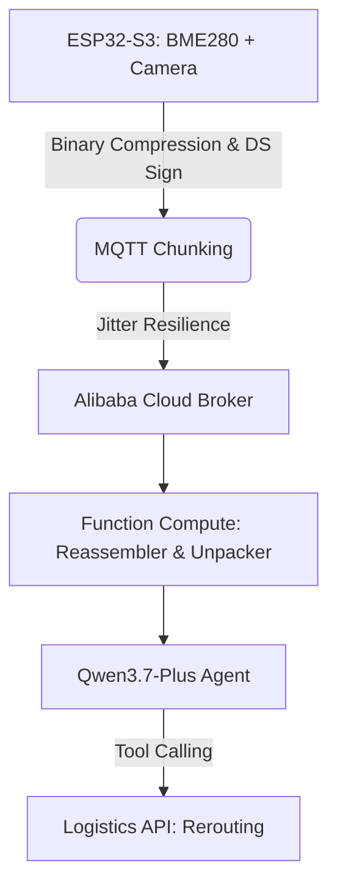

# ESP32 Cold-Chain Compliance Agent

**Zero-trust edge auditing for high-value biologicals using hardware-backed cryptography and Qwen3.7-Plus.**

The global pharmaceutical supply chain relies on fragile, cloud-dependent sensors that are trivial to forge. This project turns the ESP32-S3-CAM (or ESP32-S3 equipped with a camera module) into an autonomous, cryptographically secure compliance agent capable of locally signing audit trails and orchestrating complex logistics interventions via multimodal AI.

## Install

Requires [ESP-IDF v5.2+](https://docs.espressif.com/projects/esp-idf/en/stable/esp32/get-started/) and an Alibaba Cloud account.

```bash
# Clone and install dependencies
git clone https://github.com/suzaykid/hardware-qwen.git
cd hardware-qwen
idf.py set-target esp32s3
idf.py menuconfig # Configure MQTT and DashScope credentials
```

## Usage

1. **Provision Identity**: Burn the HMAC key to eFuse (Permanent) to wrap the private key for the Digital Signature (DS) peripheral.
   ```bash
   espefuse.py -p $PORT burn_key BLOCK_KEY0 hmac_key.bin HMAC_DS
   espsecure.py digest_private_key --keyfile hmac_key.bin --private-key private_key.pem --output wrapped_private_key.bin
   ```
2. **Flash Firmware**:
   ```bash
   idf.py build flash monitor
   ```
3. **Deploy Orchestrator**: Deploy the reassembler to Alibaba Cloud Function Compute to reassemble visual chunks and unpack the binary telemetry.

## How It Works

The system utilizes a dual-layer "Signed-Edge, Reasoned-Cloud" architecture:

- **Edge (ESP32-S3-CAM)**: Maintains a high-priority PID loop for thermal control. It captures images and sensor data, compresses the local sensor frames into space-efficient binary payloads or minimal arrays, signs them using the hardware Digital Signature (DS) peripheral, and transmits them via a 32KB chunked MQTT protocol.
- **Cloud (Qwen3.7-Plus)**: Reassembles chunks, verifies signatures, and unpacks the binary sensor payloads into structured JSON within the Function Compute reassembler prior to hitting the Qwen API. It runs localized thermodynamic decay models to predict "Time to Spoilage" and autonomously triggers rerouting via tool-calling.



## Status

**Alpha**: Core eFuse provisioning and chunked MQTT transmission are implemented. PID logic and Qwen API integration are in active prototyping.
