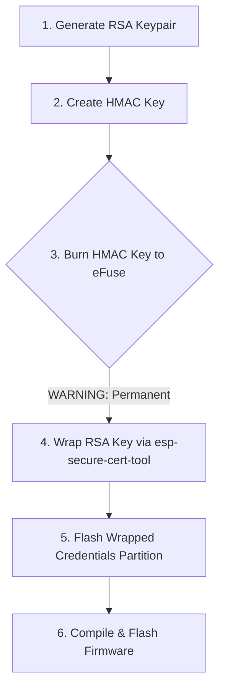

# CryoKrypton: Role 2 Manual Security Provisioning Guide

This document provides a clear, step-by-step walkthrough of all manual tasks required to establish the hardware root of trust on your physical **ESP32-S3** board.

> [!WARNING]
> **eFuse Burning is Irreversible**: Programming eFuses changes physical hardware gates on the ESP32-S3 chip by applying a higher voltage. Once burned, the eFuse block is locked forever and **cannot be modified, deleted, or cleared**. Read the instructions carefully before running the burn commands.

---

## Prerequisites & Environment Setup

Before performing any cryptographic operations, you must prepare your development environment.

### Step 1: Install ESP-IDF
Ensure you have **ESP-IDF v5.2+** installed on your system.
1. Follow the [Official Espressif Installation Guide](https://docs.espressif.com/projects/esp-idf/en/stable/esp32/get-started/) for your operating system.
2. Source the ESP-IDF environment variables in your terminal:
   ```bash
   . $HOME/esp/esp-idf/export.sh
   ```
3. Test that the toolchain is accessible by running:
   ```bash
   idf.py --version
   ```

### Step 2: Identify Your Serial Port
Connect your ESP32-S3 board to your computer using a USB-to-UART bridge port.
* **Linux**: Find the port by running `ls /dev/ttyUSB*` or `ls /dev/ttyACM*`. (Usually `/dev/ttyUSB0` or `/dev/ttyACM0`).
* Set a shell variable to simplify subsequent commands:
   ```bash
   export PORT=/dev/ttyUSB0  # Change to your actual port
   ```

---

## Step-by-Step Provisioning Flow



### Step 1: Generate the RSA-2048 Key Pair
Run the automated key generation script located in the workspace:
```bash
./scripts/generate_keys.py
```
* **Output**: This generates two files:
  * `keys/private_key.pem`: Your private key (keep this secret).
  * `keys/public_key.pem`: Your public key (shared with the Cloud Engineer for signature verification).

---

### Step 2: Generate the HMAC Key
The hardware Digital Signature (DS) peripheral uses a 256-bit (32-byte) key stored in eFuses to encrypt and decrypt the private key.
Generate a random 32-byte key:
```bash
openssl rand -out keys/hmac_key.bin 32
```
* **Output**: Creates `keys/hmac_key.bin` containing 32 random bytes.

---

### Step 3: Burn the HMAC Key to eFuse (Permanent)
Use Espressif's `espefuse.py` tool (included in ESP-IDF) to burn the HMAC key into the chip's key block. We use `BLOCK_KEY0` with key purpose `HMAC_DS`.

> [!CAUTION]
> Double check that your ESP32-S3 is connected securely and that the port is correct. Do not disconnect power or unplug the device during this command!

Run the burn command:
```bash
espefuse.py -p $PORT burn_key BLOCK_KEY0 keys/hmac_key.bin HMAC_DS
```
* **Confirmation**: The tool will ask you to confirm by typing `BURN`. Type it and press enter.
* **Result**: The key is written to the chip. The hardware automatically sets read-protection for this block, meaning **no software or code running on the ESP32-S3 can read this key block**. It can only be accessed by the hardware DS decryptor.

---

### Step 4: Wrap the RSA Key (Generate the Partition Bin)
Now, use the `esp-secure-cert-tool` to encrypt the RSA private key parameters using the HMAC key. 

1. Install the tool:
   ```bash
   pip install esp-secure-cert-tool
   ```
2. Generate the encrypted partition binary image:
   ```bash
   python3 -m esp_secure_cert.make_secure_cert_image \
       --private-key keys/private_key.pem \
       --secure-cert-type ds \
       --priv-key-len 2048 \
       --hmac-key-file keys/hmac_key.bin \
       --output-file keys/secure_cert_partition.bin
   ```
* **Output**: Generates `keys/secure_cert_partition.bin`. This contains the encrypted RSA parameters (modulus, private exponent, and Montgomery multiplication variables) wrapped securely.

---

### Step 5: Flash the Secure Certificate Partition
Now, flash the encrypted parameters binary onto the ESP32-S3. By default, the `esp_secure_cert` partition is allocated at offset `0xd0000` in standard partition configurations.

Flash the binary:
```bash
esptool.py -p $PORT write_flash 0xd0000 keys/secure_cert_partition.bin
```
* **Result**: The wrapped key parameters are now stored in flash. During boot, the firmware's `security_engine` will read this partition and configure the DS peripheral context.

---

### Step 6: Compile, Flash, and Monitor the Firmware
Now that the hardware key registers and cert partitions are provisioned, you can build and flash the main application.

1. Configure build settings (if needed):
   ```bash
   idf.py set-target esp32s3
   idf.py menuconfig
   ```
2. Compile and flash the app, then open the serial monitor:
   ```bash
   idf.py build flash monitor
   ```

### Verifying Successful Operation
In the terminal monitor, look for the boot log prints from `SECURITY_ENGINE`:
* **Expected Output**:
  ```text
  I (1280) SECURITY_ENGINE: Initializing Security Subsystem...
  I (1290) SECURITY_ENGINE: esp_secure_cert partition detected. Operating in hardware root-of-trust mode.
  I (1300) SECURITY_ENGINE: Routing signature request through ESP32-S3 hardware DS peripheral...
  ```
If you see the `hardware root-of-trust mode` log, your manual provisioning is 100% successful!
