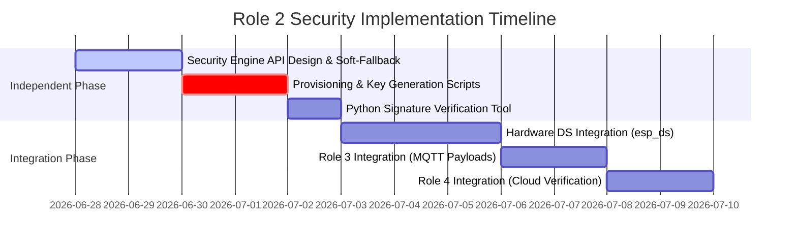

# CryoKrypton: Role 2 (Cryptographic Security) Implementation Plan

> [!IMPORTANT]
> **Role 2 Focus**: Secure identity provisioning, hardware key wrapping, and out-of-visibility signature generation using the ESP32-S3 hardware.

---

## 1. Project Understanding & Current Progress

### Project Overview: CryoKrypton
**CryoKrypton** is a zero-trust cold-chain compliance agent that monitors high-value pharmaceutical cargo (vaccines, biologics). It utilizes an **ESP32-S3-CAM** on the edge to maintain a high-priority localized thermal PID control loop, serialize environmental sensor telemetry and camera frames, sign these payloads in hardware using the **Digital Signature (DS)** peripheral, and publish them via MQTT. In the cloud, **Alibaba Cloud Function Compute** reassembles the visual chunks, verifies the cryptographic signature, unpacks the binary payloads, and sends the data to **Qwen3.7-Plus** to predict spoilage and autonomously trigger logistics interventions.

### Current Project Status Analysis
A review of the repository reveals the following:
* **Edge Core (Role 1)**: The I2C `bme280_driver` is written (with simulation fallback). The high-priority thermal `pid_control_task` is implemented in `main/main.c` and runs on Core 1 (`APP_CPU`).
* **Edge Network (Role 3)**: A basic 20-byte telemetry snapshot structure with a simple checksum is defined in `telemetry_engine.c`. However, **no camera driver, binary MQTT client, or chunking/backpressure logic is implemented yet**.
* **Edge Security (Role 2 - Your Role)**: **No cryptographic code, key-wrapping modules, or provisioning scripts have been written yet.** It is currently an empty slate.
* **Cloud Ingress (Role 4)**: No cloud reassembler, signature verification script, or Qwen API integration code is in the repository.
* **Tooling / Environment**: The local developer system currently **does not have ESP-IDF installed** (no `idf.py` or associated tools were detected in standard paths).

---

## 2. Critical Architectural Realignment

> [!WARNING]
> ### ⚠️ Critical Contradiction in original Team Roadmap
> The original `team_roadmap.md` tasks Role 2 with generating **NIST P-256 (ECDSA) signatures** using the ESP32-S3's hardware **Digital Signature (DS) peripheral**.
> 
> * **Hardware Fact**: The ESP32-S3's DS peripheral strictly supports **RSA** (up to 4096-bit), **not ECDSA**.
> * **Consequence**: If we force ECDSA (NIST P-256), the cryptographic signing must be performed in software (via Mbed TLS) or generic Bignum acceleration. This violates the non-negotiable requirement: *"The private key must never be readable by the application software (enforced by the ESP32-S3's hardware Digital Signature peripheral)"*.
> * **Solution**: We must align on using **RSA-2048** or **RSA-3072** signatures for the hardware DS peripheral. This allows absolute cryptographic isolation (private key wrapped by eFuse and decrypted only inside hardware during signature calculation). The cloud verification component (Role 4) must be configured to verify RSA signatures instead of ECDSA.

---

## 3. Role 2 Comprehensive Task List

The following tasks comprise the entire scope for Role 2, divided into **Independent Tasks** (which can be completed immediately in software simulation) and **Dependent Tasks** (requiring hardware or collaboration with other roles).

| Task ID | Task Description | Type | Dependency / Blocked By |
| :--- | :--- | :--- | :--- |
| **Task 2.1** | **Security Engine Interface & Soft-Fallback**: Implement `security_engine` component with `security_engine_init()`, `security_engine_sign()`, and `security_engine_get_public_key()`. Provide a software-based RSA signing fallback (using Mbed TLS) for development/simulation when the hardware DS peripheral is not provisioned. | **Independent** | None (can write immediately) |
| **Task 2.2** | **Key Generation & Provisioning Scripts**: Write Python shell scripts to generate a secure RSA private/public key pair and derive the encrypted private key parameters (wrapped key dataset) based on a target 256-bit HMAC key. | **Independent** | None (can write immediately) |
| **Task 2.3** | **Verification Test Suite**: Write a python verification script that takes the public key and verifies that the signatures produced by the security engine (both software-fallback and hardware-signed) are valid. | **Independent** | None (can write immediately) |
| **Task 2.4** | **Hardware DS Driver Integration**: Implement the low-level ESP-IDF hardware driver for the DS peripheral (`esp_ds_sign`), loading the wrapped key context from a dedicated flash partition. | **Dependent** | Requires ESP-IDF toolchain setup and physical hardware. |
| **Task 2.5** | **Edge Transport Integration**: Coordinate signature injection with the Transport Engineer (Role 3) so that both the binary telemetry frames and the image chunk packets contain the cryptographic signature. | **Dependent** | Depends on Role 3 establishing the MQTT packet layout. |
| **Task 2.6** | **Cloud Ingress Coordination**: Deliver the signature verification parameters and public key details to the Cloud/AI Engineer (Role 4). | **Dependent** | Depends on Role 4 setting up the reassembler function. |

---

## 4. Implementation Plan



### Phase 1: Software Foundation (Immediate)
1. **Create `components/security_engine`**:
   * Define `security_engine.h` containing API signatures.
   * Implement `security_engine.c` with a compilation switch. If hardware is simulated or keys are absent, fall back to software RSA signing using `mbedtls/rsa.h`. This ensures the code builds and runs for the whole team.
2. **Develop Provisioning Helpers**:
   * Create `scripts/generate_keys.py` to automate OpenSSL generation of RSA-2048 keypair.
   * Write `scripts/wrap_key.py` (simulating `esp-secure-cert-tool` parameter calculations) to generate the encrypted key parameters file.

### Phase 2: Hardware & Transport Integration (Once environment is ready)
3. **Write low-level `esp_ds` hardware hooks**:
   * Implement reading the encrypted private key parameter block from the `esp_secure_cert` partition or a raw flash partition.
   * Use ESP-IDF's `esp_ds_sign()` API to route the SHA-256 digest of the telemetry through the DS hardware.
4. **Integrate with Role 3**:
   * Update the binary telemetry payload struct (defined in `telemetry_engine.h`) to accommodate the RSA signature.
   * *Note:* An RSA-2048 signature is 256 bytes. Since Role 3's telemetry frames are designed to be extremely compact (currently 20 bytes), we need to carefully define how the signature is appended or transmitted.

---

## 5. Requirements & Manual Tasks (Development Strategy: Option A)

To support rapid prototyping without risking physical hardware modification or needing connected devices, the team is aligned on **Option A (Software Fallback Mode)** as the primary development strategy.

### Required Environment (For Development & Testing)
1. **Python Environment**: Ensure you have Python 3 installed with the `cryptography` library.
2. **ESP-IDF v5.2+ Installation**: (Optional for code writing, but required when compiling the final firmware binary).

### Status of Provisioning Tasks
* **eFuse Burning (Deferred)**: Burning physical HMAC keys to the chip's eFuse blocks is **deferred to final production configuration** and is not required for daily development, team testing, or the hackathon submission.
* **Flash Partitions (Deferred)**: Creating and flashing custom `esp_secure_cert` flash partitions is deferred.
* **Firmware Signing**: The firmware will run in software emulation mode, automatically loading the test RSA key and signing payloads using Mbed TLS inside standard Flash space.
* **Local Verification**: You can verify firmware signature compatibility using the provided Python scripts without any connected hardware:
  ```bash
  python3 scripts/verify_signature.py --selftest
  ```

---
*Note: If the team decides to transition from Option A to physical hardware root-of-trust, refer to [role2_manual_provisioning_guide.md](file:///home/sunny/Desktop/projects/hardware-qwen/docs/role2_manual_provisioning_guide.md) for full step-by-step instructions.*
